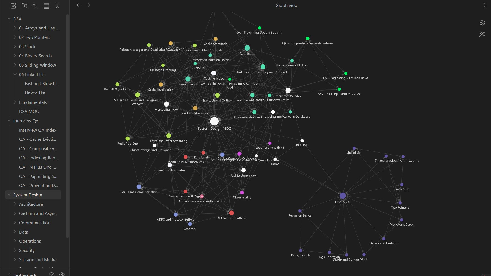

# Software Engineering Roadmap

My interview-prep knowledge base, maintained as an [Obsidian](https://obsidian.md) vault: 60+ interconnected notes covering data structures & algorithms, system design, and interview Q&A.



## What's inside

This isn't a collection of copied tutorials — it's a working knowledge base built while preparing for software engineering interviews. Every note is written in my own words, and the System Design notes are grounded in projects I've actually built: each concept links back to a real implementation in one of my repositories. Notes are densely cross-linked with `[[wikilinks]]`, so the vault works as a graph you can explore, not just a folder of files.

| Section | What's inside |
|---|---|
| [DSA](DSA/DSA%20MOC.md) | NeetCode 150 pattern notes: when to use each pattern, complexity, Python templates, pitfalls |
| [System Design](System%20Design/System%20Design%20MOC.md) | Concepts grounded in my own projects — every note links to real implementations in my repos |
| [Interview Q&A](Interview%20QA/Interview%20QA%20Index.md) | Practice questions: my original answers, reviewed and corrected, plus complete spoken answers |

You can read the notes right here on GitHub (start at [Home](Home.md)), but the vault is meant to be opened in Obsidian, where wikilinks resolve and the graph view shows how everything connects.

## How to open this vault in Obsidian

1. **Install Obsidian** — download it for free from [obsidian.md](https://obsidian.md/download) (Windows, macOS, and Linux).
2. **Get the repo** — clone it:

   ```bash
   git clone https://github.com/1Kyryll/Software-Engineering-Roadmap.git
   ```

   or download it as a ZIP (**Code → Download ZIP** on this page) and extract it.
3. **Open it as a vault** — launch Obsidian, and in the vault switcher choose **Open folder as vault**, then select the cloned/extracted `Software-Engineering-Roadmap` folder.
4. **Start at Home** — open `Home.md` and follow the links into each section.
5. **Explore the graph** — open the graph view (`Ctrl/Cmd + G`) to see the hub-and-spoke structure and the cross-links between topics.

> No plugins or special setup required — the vault works with a stock Obsidian install.

## Structure

Notes are organized as hub-and-spoke: each section has a MOC (map of content) linking to cluster indexes, which link to individual notes. Cross-cutting connections are explicit `[[wikilinks]]` — open the vault in Obsidian and check the graph view.

The System Design notes cite these projects as evidence:
[E-Commerce-System](https://github.com/1Kyryll/E-Commerce-System) ·
[Restaurant-System-Microservices](https://github.com/1Kyryll/Restaurant-System-Microservices) ·
[OneTube](https://github.com/1Kyryll/OneTube) ·
[Lychee-Chat](https://github.com/1Kyryll/Lychee-Chat) ·
[Personal-Finance-Tracker](https://github.com/1Kyryll/Personal-Finance-Tracker)
